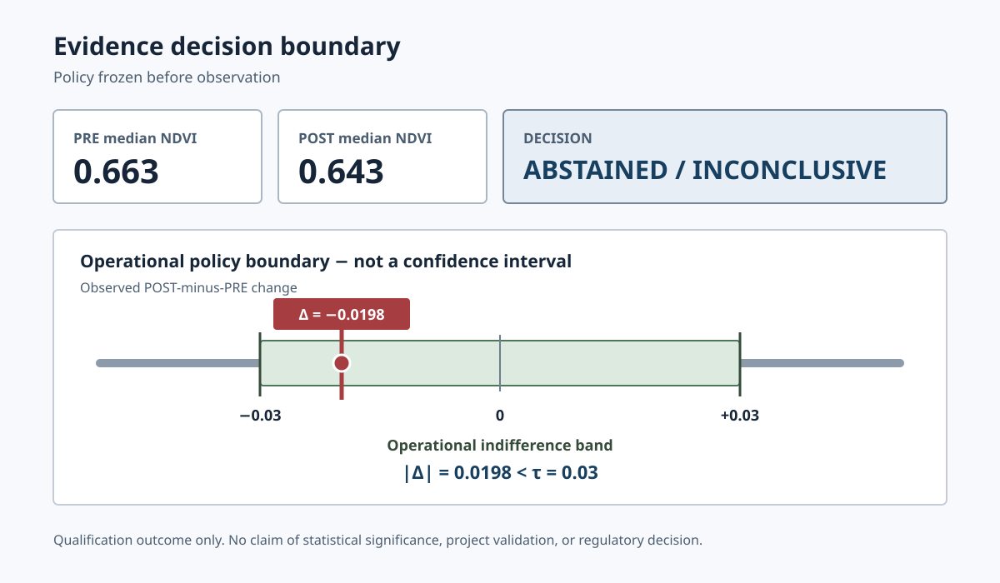

# Qualify Environmental Evidence

**Evidence before inference.**

A reproducible public-data proof of concept for deciding whether environmental evidence is sufficient and authorised to support a bounded claim before it enters a regulated financial workflow. It qualifies evidence rather than validating projects, separates sources and observations from permissible conclusions, and can qualify or [abstain](GLOSSARY.md#abstention). It is not presented as deployed in a bank, Microsoft, a regulator, or a customer environment.

Financial workflows do not fail only when evidence is missing. They also fail when available evidence is stretched beyond what it can support. This project makes that boundary explicit, inspectable, and reproducible through [provenance](GLOSSARY.md#provenance) and deterministic controls.

[](https://github.com/Mangolycheematcha/qualify-environmental-evidence/actions/workflows/offline-ci.yml)

## What This Demonstrates

- Bind a narrow question to allowlisted public sources and a policy frozen before observation.
- Resolve source identity and admissibility before transforming or comparing evidence.
- Produce structured decisions with provenance, reason codes, authority limits, and explicit abstention.
- Reproduce the demonstrated assessment offline from retained inputs without repeating external actions.



## Plain-Language Outcome

The system was asked a bounded question, found that the observed change remained inside the policy's pre-observation indifference band, and declined to produce a stronger conclusion. That is the designed control behaviour, not a failure to return a result.

The outcome does **not** mean there was no environmental change. It is not a statistical-significance result, project validation, regulatory decision, or judgment of financial suitability.

## What It Does

- Validates versioned [claim contracts](GLOSSARY.md#claim-contract), schemas, registries, and provenance relationships.
- Separates source facts from transformations, decision rules, and generated statements.
- Enforces ACCU and Safeguard Mechanism semantic boundaries before downstream inference.
- Runs bounded PRE/POST Earth-observation comparison and deterministic qualification workflows.
- Pauses when authority or evidence is insufficient, then supports idempotent resume and offline replay.

## Key Demonstrated Result

- PRE median NDVI: **0.663**
- POST median NDVI: **0.643**
- Observed change: **−0.0198**
- Operational policy band: **±0.03**
- Decision: **ABSTAINED / INCONCLUSIVE**

Because `|−0.0198| < 0.03`, the [authority ceiling](GLOSSARY.md#authority-ceiling) prevented a stronger conclusion. Full-precision values, hashes, provenance, replay evidence, and disclosed governance limitations remain in the [authoritative Step 2B closure](docs/STEP2B_V4_CLOSURE.md). Its scientific-path record is: Real raster and NDVI path | Executed against permitted live V4 assets and reproduced from cached inputs.

## Quickstart

Prepare the locked environment once. This may contact a package registry; it does not install the repository root as a package.

```text
uv sync --locked --no-install-project --extra test --extra runtime --python 3.14
```

Run the qualification example offline on POSIX or Windows:

```text
.venv/bin/python scripts/qualification_workflow.py examples/qualification/eop101132-request.json --json
.venv\Scripts\python.exe scripts\qualification_workflow.py examples\qualification\eop101132-request.json --json
```

Run the complete offline test suite with pytest caching disabled:

```text
.venv/bin/python -m pytest -o addopts="" -p no:cacheprovider -q
```

These commands do not start live EO access or consume an approval. See [REPRODUCIBILITY.md](REPRODUCIBILITY.md) for the full command and network boundary.

## How It Works

1. Validate a claim contract and its permitted sources, transformations, and statements.
2. Retrieve only admissible evidence and preserve source identity and content hashes.
3. Apply deterministic grouping, transformation, coverage, and decision rules.
4. Enforce the authority ceiling; abstain when evidence cannot support the requested claim.
5. Emit a structured assessment, provenance, checkpoints, and replay evidence.

## Value To Reviewers

- Industry partners can inspect the control design before introducing customer or confidential operational data.
- Supervisors and researchers can examine falsifiable boundaries, source-linked artifacts, and the evaluation design.
- Engineers can reproduce deterministic tests, provenance checks, and the abstention path locally.

## Project Status

| Area | Evidence-backed status |
|---|---|
| Public repository governance | Public availability authorized; Apache-2.0 is limited to owner-controlled material |
| CI | Offline validation runs on GitHub Actions |
| Step 3 deterministic evaluation | 80/80 engineering rows across 22 semantic groups; 53 development and 27 group-held-out; deterministic regression evidence only |
| Retrieval and evidence workflow | Controlled Top-1: lexical 22/25, local TF-IDF 22/25, hybrid 23/25; not external model evidence |
| Step 3 model/API evaluation | Behavioural evaluation `NOT_EXECUTED`; [B0/B1/T1/H1](GLOSSARY.md#b0--b1--t1--h1) each have 27 planned cases and 0 completed cases |
| Step 3 | `STEP_3_READY_BUT_NOT_AUTHORISED_OR_STARTED` |

At Step 2B closure, Step 3 had not started. Deterministic offline evaluation was added later; the behavioural arms remain unexecuted and current Step 3 execution is not authorized.

## Data Boundary

The public PoC uses public registry and Earth-observation sources. It contains no customer, partner, or confidential operational data, and the current implementation does not train a machine-learning model.

### Data boundary for future use

Future research or partner deployments may operate in private, access-controlled environments and may use non-public data only under appropriate governance, permissions, and data-sharing agreements. Private data and proprietary deployment assets stay outside this repository; the public contracts, controls, and reproducibility materials remain inspectable.

## Limitations

- Known provenance and canonicality limitations remain documented; the retained run is not presented as a canonical execution record. Its Step 2B closure remains `SCIENCE_VALID — GOVERNANCE_LIMITATION — NO_RERUN`, and it is one bounded case, not project, regulatory, carbon-integrity, or financial validation.
- The comparison is observational and does not establish causality, carbon quantity, additionality, or permanence.
- The operational indifference band is a policy boundary, not a scientific detection threshold or confidence interval.
- A projected-area defect affected a diagnostic field only; the independently traced decision path did not read it.
- GDAL request-level transport provenance and retry visibility are partial; cached array replay does not prove complete original transport bytes.
- CER snapshots are dated curated facts, not a live or continuously refreshed register mirror.
- Deterministic and retrieval evaluations are repository-authored engineering evidence with limited external validity; model and independent human evaluation remain unexecuted.

## Documentation And Glossary

Start with the [glossary](GLOSSARY.md), [qualification workflow](docs/QUALIFICATION_WORKFLOW.md), [Step 2B closure](docs/STEP2B_V4_CLOSURE.md), [Step 3 evaluation](docs/STEP3_EVALUATION.md), and [deployment boundary](docs/DEPLOYMENT.md). Security, contribution, source, and release guidance are in [SECURITY.md](SECURITY.md), [CONTRIBUTING.md](CONTRIBUTING.md), [DATA_SOURCES.md](DATA_SOURCES.md), and [PUBLIC_RELEASE_CHECKLIST.md](PUBLIC_RELEASE_CHECKLIST.md).

## Licensing And Release Governance

Original, owner-controlled repository material is licensed under Apache-2.0. The [licence](LICENSE) does not relicense third-party data and metadata, source responses, raster products, derived or cached artifacts, dependencies, services, or marks; those remain under their applicable terms. See [licensing scope](docs/DATA_AND_ARTIFACT_LICENSING.md), [third-party notices](THIRD_PARTY_NOTICES.md), [NOTICE](NOTICE), and [CITATION.cff](CITATION.cff).

Continued public availability is authorized in [GitHub Issue #3](https://github.com/Mangolycheematcha/qualify-environmental-evidence/issues/3). The issue and [public-release authorization record](docs/PUBLIC_RELEASE_AUTHORIZATION.md) preserve the Apache-2.0 scope, third-party exclusions, and accepted historical email disclosure. Source identity records attribution and provenance; it does not imply affiliation, endorsement, partnership, approval, or validation.
