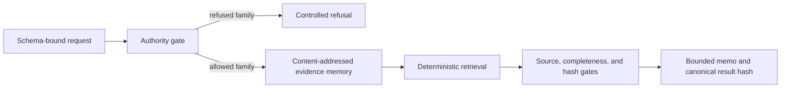

# End-to-End Qualification Workflow

## Purpose

The workflow turns source-attributed CER registry facts and a frozen observational result into a bounded evidence memo. It qualifies what cited evidence can support. It does not validate an ACCU, certify a project, calculate carbon, determine compliance, or recommend a financial action.

## Deterministic Path



1. Strict JSON rejects duplicate keys and non-finite numbers.
2. The request schema binds project ID, controlled claim family, question, and output type.
3. The authority gate refuses causal, carbon-quantity, credit-quality, ACCU/SMC-equivalence, compliance, financial-action, trading, and tokenisation requests before fact retrieval.
4. Evidence memory validates exact source IDs, canonical URIs, authority scopes, document schema, and unique fact IDs. It computes a SHA-256 for every source document and a deterministic memory-snapshot hash.
5. Retrieval uses claim family, required tags, project identity, lexical overlap, and stable tie-breaking. Question text cannot change the controlled claim family or source policy.
6. The assurance layer checks evidence identity, source authority, required-tag coverage, non-inference constraints, and the frozen Step 2B run binding.
7. Output is schema-validated and receives a SHA-256 over canonical JSON excluding the hash field itself.

This layer is deterministic assurance in the software-control sense. It is not an audit, assurance engagement, legal opinion, regulatory finding, or scientific validation.

## Evidence Inputs

| Evidence | Status | Authority |
|---|---|---|
| Seven curated CER ACCU project records | Real public CER facts across six method types, accessed 2026-09-05 | Registry facts only |
| Curated Arcadia 2024-25 Safeguard row | One field-level extract from the official CER CSV, accessed 2026-09-05 | Facility-period facts only; reports `SMCs issued = 9,693` but does not independently prove an issuance event |
| Curated CER ACCU/SMC definitions | Real public CER definitions, accessed 2026-09-05 | Unit semantics only |
| Frozen Step 2B V4 summary | Hash-bound derivative of the immutable local run | Bounded observation only |

The CER files are curated snapshots, not raw pages, complete exports, or a live API response. A reviewer should re-check the official source before relying on a time-sensitive registry fact.

## ACCU And SMC Boundary

| Concept | CER public meaning used here | The workflow must not infer |
|---|---|---|
| ACCU | One tCO2-e of emissions that would otherwise have been released into the atmosphere | Credit quality, project integrity, causality, additionality, price, or suitability |
| SMC | Unit associated with a Safeguard facility's emissions below its baseline; not an offset | Offset equivalence, environmental equivalence, price parity, or automatic substitutability |

Both concepts use a one-tonne carbon-dioxide-equivalent accounting unit, but that shared unit does not make their legal, evidentiary, environmental, or market meanings interchangeable.

## Run The Demo

```text
python scripts/qualification_workflow.py examples/qualification/eop101132-request.json --json
python scripts/qualification_workflow.py examples/qualification/accu-smc-boundary-request.json --json
python scripts/evaluate_qualification.py --json
```

All three commands are offline. They do not access CER, STAC, Planetary Computer, raster assets, an LLM, or an approval service.
